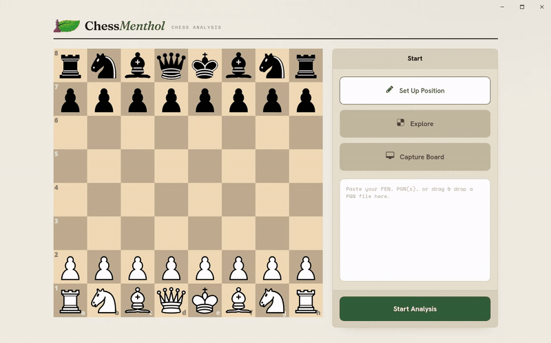

<p align="center">
  
</p>

# ChessMenthol

A cross-platform chess assistant that reads a chess board — from your screen or from a web
page — recognizes the position (with computer vision or the site's own DOM), and analyzes it
with Stockfish: streaming evaluations, best lines, and chess.com-style move classification
(brilliant / great / best / … / blunder / miss). It ships as a **desktop app** and a **browser
extension** that share one analysis core.

Everything runs **locally and offline**: chess logic and move classification are plain
TypeScript; the board-vision pipeline runs in **WebAssembly** (onnxruntime-web) inside a
**Svelte 5** UI. The **desktop app** wraps that in a thin **Tauri 2 (Rust)** shell that does what
a web page cannot — capture the screen and run a **native Stockfish** engine.

The **browser extension** (Chrome & Firefox) brings the same core into a **side panel**: on
**chess.com** and **Lichess** it reads the board live from the page, and on any other page it
captures the tab on demand and recognizes it with the same vision pipeline. In the extension,
Stockfish runs as **WebAssembly** in the panel. Nothing leaves your machine either way.

<p align="center">
  
</p>

## Features

- **Screen-capture board recognition** — drag a box over any on-screen board (chess.com,
  Lichess, a PDF, a video) and ChessMenthol reads the position with computer vision; no
  account, no upload.
- **Live Stockfish analysis** — evaluation, best move, and multiple principal variations
  (MultiPV) with an eval bar that updates as the position changes.
- **chess.com-style move classification** — every move labeled across 10 classes (brilliant,
  great, best, excellent, good, book, inaccuracy, mistake, blunder, miss).
- **Full-game review** — import a PGN or analyze a captured/played game to get a computer
  report (per-player accuracy %, ACPL, and per-class counts), an eval graph, and a Review mode
  that steps through the game move-by-move with badges and auto-play.
- **Position editor & play** — set up any position by hand, flip the board, and play out moves.
- **Bring-your-own engine** — ships with a native Stockfish, and you can add any external UCI
  engine and tune its options (desktop).
- **Browser extension (Chrome & Firefox)** — a side panel that reads chess.com / Lichess boards
  live, captures any other page on demand, and shows the same eval bar, best lines, best-move
  arrows, and turn / FEN controls. See [Installation](#browser-extension-chrome--firefox).

## Installation

Download the installer for your OS from the
[**Releases**](https://github.com/rashidmya/ChessMenthol/releases/latest) page.

> The installers are **unsigned**, so each OS shows a first-launch warning — steps to allow the
> app are below. Downloads are large (~200 MB) because the full Stockfish NNUE build is bundled.

### Windows

Run the `.msi` or `.exe`. SmartScreen may warn on an unsigned app — click **More info → Run
anyway**.

### macOS

Open the `.dmg` and drag **ChessMenthol** to Applications. It is unsigned and un-notarized, so
Gatekeeper blocks it on first launch — **right-click the app → Open** (then confirm), or clear
the quarantine flag:

```bash
xattr -dr com.apple.quarantine /Applications/ChessMenthol.app
```

The macOS build is a universal binary (Apple Silicon + Intel).

### Linux

Use the portable `.AppImage`, or install the `.deb` / `.rpm`:

```bash
chmod +x ChessMenthol_*.AppImage && ./ChessMenthol_*.AppImage
```

- **Screen capture** on Wayland compositors without `wlr-screencopy` (KWin/Mutter) shells out
  to a screenshot tool — install one of **`spectacle`** (KDE), **`grim`** (wlroots), or
  **`gnome-screenshot`** (GNOME). X11 captures directly.
- If the window fails to render on Wayland (WebKitGTK DMABUF crash, *"Gdk Error 71"*), launch
  with:
  ```bash
  WEBKIT_DISABLE_DMABUF_RENDERER=1 ./ChessMenthol_*.AppImage
  ```

### Browser extension (Chrome / Firefox)

The extension isn't on the Chrome Web Store / Add-ons (AMO) yet — install it unpacked from the
[**Releases**](https://github.com/rashidmya/ChessMenthol/releases) page (the latest **`ext-v*`**
release, e.g. `ext-v0.1.0`).

**Chrome / Edge**

1. Download `chessmenthol-extension-*-chrome.zip` and unzip it.
2. Open `chrome://extensions`, turn on **Developer mode**, click **Load unpacked**, and pick the
   unzipped folder.
3. Click the ChessMenthol toolbar icon to open the side panel, then open a **chess.com** or
   **Lichess** game — the board is read live. On any other page, click **Capture** in the panel.

**Firefox** (Developer Edition, Nightly, or ESR — release/Beta can't install unsigned add-ons)

1. Download `chessmenthol-extension-*-firefox.zip`.
2. Open `about:config`, set `xpinstall.signatures.required` to **`false`**, then open
   `about:addons` → **⚙ → Install Add-on From File** and pick the zip.
3. Open the **ChessMenthol** sidebar, then open a **chess.com** or **Lichess** game — the board is
   read live. On any other page, click **Capture** in the panel.

Chrome shows a *"Read and change all your data on all websites"* prompt at install: that access
is what the on-demand **Capture** button needs (`chrome.tabs.captureVisibleTab` requires
`<all_urls>`); live board reading by itself only touches chess.com and Lichess.

## Development

This is an **npm-workspace monorepo**: the desktop app (`apps/desktop`), the browser extension
(`apps/extension`), and the shared chess / engine / vision core (`packages/core`). Run
`npm install` (or `npm ci`) **from the repo root** to install every workspace.

### Desktop app

The renderer is Svelte 5 + TypeScript; the Tauri (Rust) shell lives under `apps/desktop/src-tauri/`.

**Prerequisites**

- **Node.js** (LTS) and **npm**
- **Rust** (stable) + the [Tauri 2 system prerequisites](https://tauri.app/start/prerequisites/)
  for your OS. On Debian/Ubuntu:
  ```bash
  sudo apt-get install -y libwebkit2gtk-4.1-dev libgtk-3-dev librsvg2-dev patchelf
  ```

**Run**

```bash
npm install                       # from the repo root (installs every workspace)
cd apps/desktop
node scripts/fetch-sidecar.mjs    # ONCE: provision the native Stockfish sidecar (gitignored)
npm run tauri dev                 # desktop app (screen capture enabled)
```

`npm run dev` serves the renderer in a plain browser for **UI work only** — analysis (native
engine) and screen capture require the desktop app. On some Wayland setups prefix a command
with `WEBKIT_DISABLE_DMABUF_RENDERER=1` (see the Linux notes above).

**Test & type-check**

```bash
cd apps/desktop
npm run test    # Vitest (engine, orchestrator, classify, vision parity)
npm run check   # svelte-check + tsc
```

**Build installers**

```bash
cd apps/desktop
node scripts/fetch-sidecar.mjs    # once (see above)
npm run tauri build               # -> apps/desktop/src-tauri/target/release/bundle/
```

On Linux the AppImage step needs FUSE; in a container prefix
`APPIMAGE_EXTRACT_AND_RUN=1 npm run tauri build`, or pass `-- --bundles deb,rpm` to skip it.

### Browser extension

Built with [WXT](https://wxt.dev) (Chrome MV3 + Firefox MV2) and Svelte 5.

```bash
npm install                # from the repo root
cd apps/extension
npm run dev                # Chrome dev build with live reload
npm run dev:firefox        # Firefox dev build
npm run build              # -> apps/extension/.output/chrome-mv3
npm run build:firefox      # -> apps/extension/.output/firefox-mv2
npm test                   # Vitest
npm run check              # svelte-check
```

Load the built `.output/chrome-mv3` (or `.output/firefox-mv2/manifest.json`) unpacked as in
[Installation](#browser-extension-chrome--firefox).

**Releases** — pushing a `v*` tag builds and uploads the desktop installers for all three OSes to
a GitHub Release (`.github/workflows/release.yml`); an **`ext-v*`** tag builds the Chrome/Firefox
zips via a separate workflow (`release-extension.yml`). PRs and branch pushes run `ci.yml`.

## License

[GPL-3.0-or-later](LICENSE). Third-party components and vendored assets are credited in
[`NOTICE.md`](NOTICE.md).
